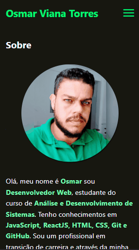

# Portfolio Osmar Viana

Portfolio criado para mostrar um pouco do meu conhecimento com programação front-end.

 

### Tela Desktop

 

 

### Tela Mobile

 

 

## Tecnologias usadas

- HTML
- CSS
- JavaScript

 

## Links

https://osmarviana.github.io/portfolio-osmarviana/

 

# Autor

## Osmar Viana

 
  
   
  
   
  
   

